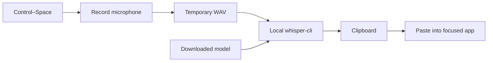

# MacWhispr

**Speak. Transcribe locally. Paste into your Mac apps.**

MacWhispr is a native macOS menu bar dictation app built by [Hrithik Saini](https://github.com/hrithiksaini99). Press **Control–Space**, speak, and press it again to paste your words into the app you were using. Transcription runs on your Mac through [whisper.cpp](https://github.com/ggml-org/whisper.cpp), without an API key or a cloud transcription service.

## Features

- **Toggle dictation:** press Control–Space to start and press again to finish.
- **Push to Talk:** hold Control–Space to record, then release to transcribe.
- **Automatic paste:** returns to the app that had focus when recording began.
- **Clipboard fallback:** keeps the transcript available for manual paste when Accessibility access is missing.
- **Microphone selection:** use the system default or choose an available input device.
- **Model management:** select and download Whisper models from the menu, with download progress in the menu bar.
- **Permission status:** check Microphone and Accessibility access and open their settings from the menu.
- **Silence detection:** skips transcription when the recording contains no detectable speech.
- **Native menu bar interface:** built with AppKit and Swift, with no Swift package dependencies.

## Requirements

| Requirement | Details |
| --- | --- |
| Operating system | macOS 13 or later |
| Swift toolchain | Swift 5.10 or later; Xcode Command Line Tools or Xcode |
| Transcription engine | `whisper-cli`, installed through Homebrew's `whisper.cpp` formula |
| Model | At least one downloaded GGML model |
| Permissions | Microphone for recording; Accessibility for automatic paste |
| Internet | Needed to install the engine and download models; dictation runs locally afterward |

The app was built and exercised on an Apple Silicon Mac. Intel compatibility is supported by the package target and binary lookup paths but has not been verified on an Intel Mac.

## Quick start

Install the [Xcode Command Line Tools](https://developer.apple.com/xcode/resources/) if they are not already installed, then install the transcription engine using [Homebrew](https://brew.sh/):

```bash
xcode-select --install
brew install whisper.cpp
```

Clone the repository and launch the app:

```bash
git clone https://github.com/hrithiksaini99/MacWhispr.git
cd MacWhispr
./script/build_and_run.sh
```

The script builds the Swift package, assembles and signs `dist/MacWhispr.app` for local use, and launches it. A waveform icon appears in the macOS menu bar. There is no Dock icon or main window.

1. Allow **Microphone** access when prompted.
2. Enable **MacWhispr** in **System Settings → Privacy & Security → Accessibility** for automatic paste.
3. Open the waveform menu and choose a model under **Model**. The default is **Base (English)**. Selecting a model that is not installed starts its download.
4. Focus a text field in another app.
5. Press **Control–Space**, speak, and press **Control–Space** again. MacWhispr transcribes and pastes the result.

To use **Push to Talk**, choose it under **Activation Mode**, then hold the shortcut while speaking and release it when finished. Notifications are optional and are used for error messages.

## Models

Models download from the [whisper.cpp model repository on Hugging Face](https://huggingface.co/ggerganov/whisper.cpp/tree/main). Sizes below are approximate and match the app's catalog.

| Model | Download | Intended use |
| --- | ---: | --- |
| Base (English) | 148 MB | Default; fastest option in the catalog |
| Small (English) | 488 MB | More accuracy with a modest increase in size |
| Medium (English) | 1.53 GB | Higher accuracy with more processing and memory |
| Large v3 Turbo | 1.62 GB | Large model optimized for speed |
| Large v3 | 3.10 GB | Largest option in the catalog |

Model size and recording length affect memory use and transcription time. The app currently uses whisper-cli's default language behavior and has no language selector.

Model files live at:

```text
~/Library/Application Support/MacWhispr/models/
```

Use **Open Model Folder** in the menu to inspect that directory. You can also place a compatible model file there manually using the exact filename listed in `Sources/MacWhispr/ModelManager.swift`.

## How it works



Audio is captured as a 16 kHz mono PCM WAV. When recording stops, MacWhispr checks the peak audio level, runs whisper-cli with the selected model, trims the result, and writes it to the clipboard. With Accessibility permission, it activates the original app and sends Command–V.

Choosing a specific microphone changes the macOS system default input device through CoreAudio. This can also affect other apps using the system default input.

## Privacy and storage

- Audio and transcription are processed locally; recordings are not uploaded for transcription.
- Model downloads contact Hugging Face and its download infrastructure.
- Temporary recordings are removed after transcription succeeds or fails. Abrupt termination can leave temporary files behind.
- There is no account system, analytics, or transcript history database.
- The latest transcript remains on the macOS clipboard and is subject to your existing clipboard managers and system clipboard behavior.
- Successful transcripts are written to standard output; errors and app events are available through local logging. Consider this when capturing debugging output.
- Activation mode, selected model, and preferred input device are stored in macOS `UserDefaults`.

## Development

```bash
# Compile without launching
swift build

# Build and launch the app bundle
./script/build_and_run.sh

# Build, launch, and verify that the process starts
./script/build_and_run.sh --verify

# Stream app logs
./script/build_and_run.sh --logs

# Stream MacWhispr's dictation events
./script/build_and_run.sh --telemetry

# Launch under LLDB
./script/build_and_run.sh --debug
```

The Codex **Run** action is configured in `.codex/environments/environment.toml` and uses the same build script. The script stops an existing MacWhispr process before rebuilding; finish any active dictation first.

The generated bundle is signed ad hoc for local development. It is not notarized or packaged as a distributable release.

### Tests

Run the local transcription integration check after downloading **Base (English)**:

```bash
./script/test_transcription.sh
```

This creates a spoken sample with macOS `say`, converts it to WAV, runs the installed Whisper engine, and checks that the expected phrase is recognized. It does not record your microphone or exercise automatic paste.

The Swift test target checks catalog identifiers and activation-mode persistence:

```bash
swift test
```

This requires a toolchain with XCTest available, typically a full Xcode installation. On the development Mac, the Command Line Tools installation could build the app but could not resolve XCTest, so the Swift tests were not executed there. The build, app launch, signature check, and transcription integration check passed. Interactive dictation was also confirmed working by the app's author.

For an interactive acceptance check, use a blank text document and verify Toggle recording, Push to Talk, automatic paste, and the silence error with a muted microphone.

## Configuration

MacWhispr finds the transcription executable in this order:

1. The `MACWHISPR_WHISPER` environment variable, if it points to an executable.
2. `/opt/homebrew/bin/whisper-cli` on Apple Silicon.
3. `/usr/local/bin/whisper-cli` on Intel.

For a custom installation, Finder-launched apps need the variable in the launch environment:

```bash
launchctl setenv MACWHISPR_WHISPER /absolute/path/to/whisper-cli
```

Quit and relaunch MacWhispr after setting it. To remove the override:

```bash
launchctl unsetenv MACWHISPR_WHISPER
```

## Troubleshooting

| Symptom | What to check |
| --- | --- |
| Control–Space does nothing | Check **System Settings → Keyboard → Keyboard Shortcuts → Input Sources** for a conflicting shortcut. The app currently uses a fixed shortcut. |
| Microphone access is required | Enable MacWhispr under **Privacy & Security → Microphone**, then restart the app if needed. |
| Text is copied but not pasted | Enable MacWhispr under **Privacy & Security → Accessibility**, or paste manually with Command–V. Some apps and secure input fields may reject synthesized paste. |
| Selected microphone is unavailable | Reconnect it or choose **System Default** under **Input Device**. |
| No speech is detected | Confirm the correct input is selected, unmute the microphone, and speak closer to it. |
| whisper-cli is missing | Run `brew install whisper.cpp`, or configure `MACWHISPR_WHISPER`. |
| Model download fails | Check your network's access to Hugging Face and available disk space. Retry from the model menu. |
| Transcription fails after a model download | Remove the incomplete model from **Open Model Folder** and select the model again to download it. |
| Permissions stop working after rebuilding | Ad hoc signing can cause stale permission grants. Remove and re-add MacWhispr in the affected privacy setting. |
| `swift test` cannot find XCTest | Use a full Xcode toolchain; the transcription integration script can run with Command Line Tools. |

## Project structure

```text
MacWhispr/
├── Sources/MacWhispr/
│   ├── main.swift                     # App lifecycle, hotkey, and dictation orchestration
│   ├── MenuBarController.swift        # Menu bar interface and callbacks
│   ├── DictationService.swift         # Recording, transcription, and paste
│   ├── AudioInputDeviceManager.swift  # Microphone discovery and routing
│   ├── ModelManager.swift             # Model catalog, selection, and downloads
│   └── ActivationMode.swift           # Persisted recording mode
├── Tests/MacWhisprTests/              # Swift tests
├── script/
│   ├── build_and_run.sh               # Build, package, sign, and launch
│   └── test_transcription.sh          # Local transcription integration check
├── .codex/environments/              # Codex Run configuration
├── Info.plist
└── Package.swift
```

Built by **Hrithik Saini**. Speech recognition is powered by the independently maintained **whisper.cpp** project and Whisper model files.
