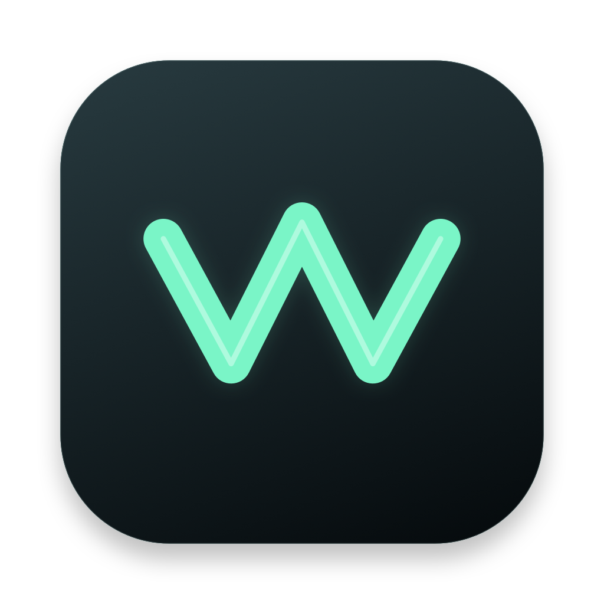
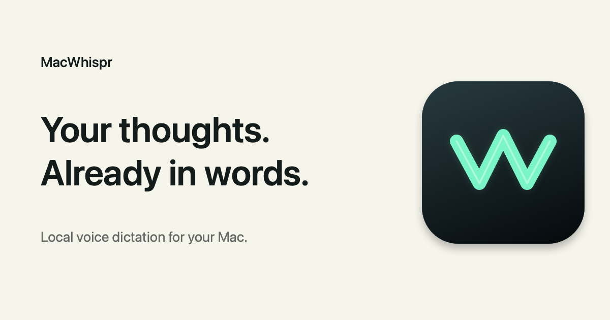
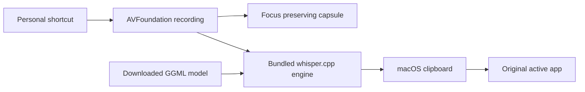

  

<h1 align="center">MacWhispr</h1>

<strong>Your thoughts. Already in words.</strong>

  A focused voice dictation companion for macOS. Speak from any app, let a local Whisper model transcribe your words, and continue exactly where you were writing.

  <a href="https://hrithiksaini99.github.io/MacWhispr/">Website</a>
  ·
  <a href="https://hrithiksaini99.github.io/MacWhispr/design.html">Interactive technical blueprint</a>
  ·
  <a href="https://github.com/hrithiksaini99/MacWhispr/releases">Releases</a>

## Installation

1. Download the latest `.dmg` release from the [Releases page](https://github.com/hrithiksaini99/MacWhispr/releases/latest).
2. Open the `.dmg` file and drag **MacWhispr.app** to your **Applications** folder.
3. Launch MacWhispr from Applications or Spotlight. It will appear in your menu bar.
4. On first run, grant **Microphone** access for recording and **Accessibility** access (in System Settings → Privacy & Security) so MacWhispr can automatically paste transcribed text.

## Usage

1. **Select a Model:** Click the MacWhispr menu bar icon and choose a model to download (Base English is recommended).
2. **Dictate:** Place your text cursor in any application where you want to type.
3. **Trigger:** Press the default shortcut **Control-Space** (or your custom shortcut) to start dictating.
4. **Finish:** Speak your thought, then press the shortcut again. MacWhispr will process your speech locally and insert the transcribed text directly into the active app.

## Designed to stay out of the way

MacWhispr is a menu bar app with one purpose: shorten the distance between a thought and written text. It does not open a workspace, move keyboard focus, or ask the user to manage a transcript window.

The interaction begins with a personalized global shortcut. A compact capsule appears near the bottom of the active display, confirms that the microphone is listening, responds to real audio levels, and changes into a directional transcription signal when recording stops. The finished text is placed into the app that was active when dictation began.

The shortcut, microphone, model, and activation style all belong to the user. Toggle mode works like a switch. Push to Talk records only while the shortcut is held.

## The visual system

The capsule uses a graphite surface, a mint signal color, and a custom W voice mark shared with the application icon. Its small footprint keeps it visible without competing with the document beneath it.

| State | Visual response | Meaning |
| --- | --- | --- |
| Listening | Audio bars follow the microphone every 50 ms | Recording is active |
| Transcribing | Three fast directional traces cross the signal well | Local speech processing is active |
| Inserted | A mint confirmation replaces the signal | Text has reached the active app |
| Action required | A warm status treatment appears | The notification contains the next step |

Motion communicates activity without inventing progress. Transcription traces repeat instead of filling toward a false percentage, and the completion state appears only after paste succeeds. Reduce Motion replaces continuous movement with clear static states.

## Built as a native Mac utility

MacWhispr uses Swift, AppKit, SwiftUI, AVFoundation, Core Audio, Carbon hot keys, and the macOS Accessibility APIs. It has no application framework dependency and no account layer.

The AppKit application delegate owns the menu bar lifecycle, global shortcut registration, recording orchestration, and return to the original app. SwiftUI draws the custom capsule while a narrow `NSPanel` bridge keeps it above other windows without becoming the main window. The shortcut recorder uses a focused AppKit panel because global key capture and Carbon registration are platform responsibilities.

The release engine is a pinned static build of whisper.cpp with Accelerate and embedded Metal support. It targets Apple Silicon and links only Apple system libraries. Model files remain separate so each user can choose the balance of speed, memory, language support, and accuracy.

## Personal shortcut

The menu displays the active shortcut and opens a native recorder for changing it. A shortcut must include Command, Option, or Control so ordinary typing is never captured globally. MacWhispr attempts to register the new combination before saving it. When another app or macOS already owns that combination, the recorder stays open and the previous shortcut is restored when the panel closes.

The default is **Control–Space**. Personalized shortcuts persist across launches and work with both Toggle and Push to Talk modes.

## Local processing and privacy

Audio is recorded into a temporary 16 kHz mono WAV and passed to the speech engine on the same Mac. Model downloads contact Hugging Face, but recordings are not uploaded for transcription. MacWhispr has no analytics integration, transcript database, cloud transcription API, account, or API key.

Temporary audio and engine output are removed after success, failure, or cancellation. The latest transcript remains on the macOS clipboard, where an installed clipboard manager may retain it. Successful transcripts are not printed to application logs.

Automatic insertion requires Accessibility permission because macOS protects control of other applications. Without that permission, the transcript remains available for manual paste. Selecting a microphone changes the system default input and can affect other apps that follow that setting.

## Product structure

- `ActivationMode` and `HotKeyShortcut` hold durable user preferences.
- `DictationService` records and meters audio.
- `Transcriber` owns the external process, timeout, cancellation, and bounded diagnostics.
- `ModelManager` downloads and validates GGML models before installation.
- `MenuBarController` presents status, device, model, mode, permission, and shortcut controls.
- `DictationCapsuleController` owns the focus preserving floating panel.
- `DictationCapsuleView` and `CapsuleSignalView` draw the branded recording experience.
- `site` contains the responsive marketing site, illustrative product demo, setup, privacy, terms, and 404 pages.

## Availability

MacWhispr is available for Apple Silicon Macs running macOS 13 or later. You can download the latest `.dmg` from the [Releases page](https://github.com/hrithiksaini99/MacWhispr/releases). Note: As an open-source project without a paid Apple Developer ID, you may need to right-click and select "Open" the first time you launch the app to bypass Gatekeeper.

## License

MacWhispr is open-source software licensed under the [MIT License](LICENSE).

whisper.cpp, model files, and Manrope remain under their respective licenses; see [third party notices](docs/THIRD_PARTY_NOTICES.md).
